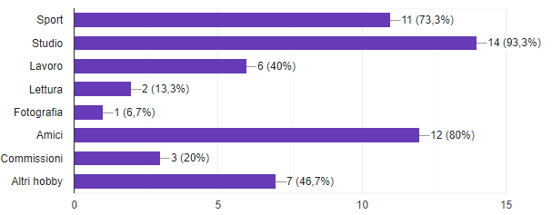
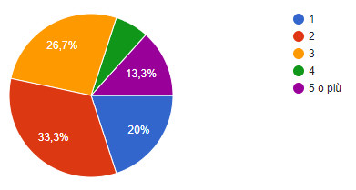
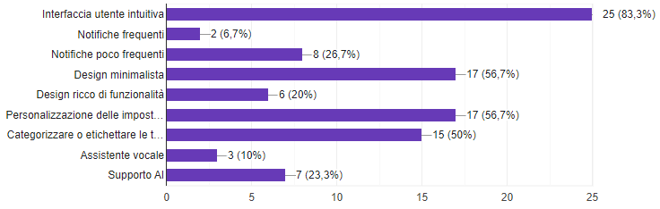

# 2023_assignment2_MTM

## Group Members
- Lorenzo Molinari
- Massimo Trippetta
- Lorenzo Megna

## Project Repository
- [Repository](https://gitlab.com/gruppomtm/2023_assignment2_mtm)

# Capitolo 1: Progetto

## TasKING:
L'obiettivo del progetto è quello di sviluppare un'applicazione volta alla gestione delle attività quotidiane dei vari utenti. Sarà, quindi, una sorta di agenda intelligente dove si potrà tenere traccia degli appuntamenti, promemoria e tutte la commissioni che un qualsiasi utente ha da tenere a mente. 
L'applicazione si chiamerà  "TasKING" e sarà completamente customizzabile tramite i supporti che verranno forniti dagli sviluppatori.
Per aiutare gli sviluppatori in una progettazione più solida e funzionale, è stato creato un sondaggio con lo scopo di indagare le preferenze delle persone; dall'esito di questa ricerca verranno ricavate molte informazioni per l'implementazioni di utilissimi widget che renderanno l'esperienza d'uso piacevole e funzionale.

# Capitolo 2: Coinvolgimento degli Stakeholders

## Coinvolgimento degli Stakeholders

### Disoccupati:

**Requisiti:** Preferenze sull'interfaccia utente e le funzionalità desiderate.

**Stakeholder:** Disoccupati.

**Motivazione:** Raccogliere feedback iniziali per orientare lo sviluppo in base alle esigenze degli utenti.

**Rilevanza:** I disoccupati sono uno dei gruppi principali di utenti finali di "TasKING", utilizzando l'app per gestire le attività quotidiane durante la ricerca di lavoro.

**Metodo di contatto:** Conduzione di sondaggi online per comprendere le aspettative dei disoccupati.

### Studenti universitari:

**Requisiti:** Esperienze specifiche nell'utilizzo dell'app per gestire impegni accademici.

**Stakeholder:** Studenti universitari.

**Motivazione:** Ottimizzare l'app per adattarsi alle esigenze degli studenti universitari.

**Rilevanza:** Gli studenti universitari costituiscono un altro segmento chiave degli utenti di "TasKING" utilizzando l'app per organizzare gli impegni accademici e personali.

**Metodo di contatto:** Sondaggio online per raccogliere feedback dettagliato da parte degli studenti.

### Lavoratori:

**Requisiti:** Preferenze sull'interfaccia utente e le funzionalità desiderate.

**Stakeholder:** Lavoratori.

**Motivazione:** Raccogliere feedback iniziali per orientare lo sviluppo in base alle esigenze dei lavoratori.

**Rilevanza:** I lavoratori sono un gruppo di utenti importanti, integrando "TasKING" nella loro routine quotidiana per gestire impegni professionali e personali.

**Metodo di contatto:** Conduzione di sondaggi online per comprendere le aspettative dei lavoratori.

# Capitolo 3: Analisi dei Risultati

## Analisi dei Risultati

- [Questionario](https://forms.gle/iQDfEuTpgtrnpYVV6)

Il questionario ha fornito informazioni preziose sulle preferenze e le aspettative degli utenti finali. Di seguito sono riportati alcuni dei risultati chiave:

  ## Workflow:
Il questionario divide le proprie possibili domande in base alle prime risposte dell'utente, infatti se l'utente dichiara di essere uno studente riceverà domande con possibili risposte diverse rispetto a quelle di un lavoratore.
L'obiettivo è quello di ricevere un feedback dettagliato da ogni stakeholder, cercando di differenziare le proprie domande e risposte.
All'interno del questionario troviamo 11 domande per ogni stakeholder, partendo da domande generali e conoscitive, arrivando a richieste più specifiche alal fine di esso.
In seguito sono riportati alcuni dei risultati chiave per ogni stakeholder:

### Studenti universitari:

Gli studenti universitari hanno dichiarato per il 60% di gestire 3 attività giornaliere, inoltre, il 13.3% gestisce 5 o più attività giornaliere, le attività gestite dai vari utenti sono molteplici; Come possiamo vedere dal seguente grafico, le più popolari sono lo sport (73.3%), lo studio(93.3%) e gli amici(80%):

Il 26% degli studenti ha dichiarato di aver già utilizzato un'applicazione per la gestione delle loro attività, le applicazioni utilizzate maggiormente da essi sono Notion, Calendar, Nike e fatsecret.

### Lavoratori:

Il 33.3% dedica più di 50 ore settimanali al proprio lavoro. Rispetto agli studenti solo il 26% dei lavoratori gestisce 3 attività giornaliere; in generale i lavoratori spendono meno tempo per le loro attività al di fuori del lavoro rispetto ai giovani

Per quanto riguarda le attività gestite nello specifico, i lavoratori tendono a fare meno sport e a frequentare meno gli amici rispetto agli studenti universitari, occupandosi più di lavoro, commissioni e lettura.

Inoltre, 3 lavoratori hanno confermato di aver utilizzato già app come TasKING, specialmente Calendario, Productive, Habitify ed Outlook.

### Analisi risultati finali:

Alla fine del questionario possiamo trovare due domande fondamentali, la prima chiede algli intervistati quali caratteristiche siano essenziali per una buona app di questo genere mentre la seconda chiede un suggerimento aggiuntivo sull'app da parte dell'utente.
Per la prima domanda le risposte sono molto varie, per la risposta di avere un interfaccia utente intuitiva troviamo d'accordo l'83,3% degli intervistati, indicandoci come questa sia una funzionalità importantissima da implementare, cosi come il design minimalista e la personalizzazione delle impostazioni.

Per quanto riguarda gli ulteriori suggerimenti abbiamo notuta delle richieste riguardanti la sincronizzazione tra più dispositivi, la flessibilità in caso di un cambio di piani all'ultimo momento e la semplicità nell'utilizzo dell'app.

# Capitolo 4: Studio delle funzionalità e Analisi dei requisiti

## Stakeholders

Per l'implementazione e un mantenimento di un'applicazione sarà necessario, avvalersi di alcuni Stakeholders.

### Utenti:

**Requisiti:** Essere un utente con account TasKING valido.

**Stakeholder:** Tutti gli utenti.

**Motivazione:** Raccogliere feedback per orientare lo sviluppo in base alle esigenze dei lavoratori.

**Rilevanza:** Gli utenti sono una fonte inesauribile e necessaria di informazioni. Essi vanno ascoltati e le loro difficoltà vanno agevolate tramite precise patch.

**Metodo di contatto:** Conduzione di sondaggi online per comprendere le loro aspettative.

### Servizio Clienti:

**Requisiti:** Persone di esperienza che riescano ad interagire con gli utenti e che sappiano far fronte ad ogni eventuale problematica da essi riscontrata.

**Stakeholder:** Persone stipendiate che possono essere contantattate tramite telefono o e-mail e che rispondono a nome di TasKING.

**Motivazione:** E' necessario fornire assistenza ad un cliente. Questo significa fidelizzarlo a TasKING. 

**Rilevanza:** Essi forniscono un aiuto cruciale nel comprendere le problematiche riscontrate dagli utenti.

**Metodo di contatto:** Annunci di lavoro publicati in rete e su applicazioni specifiche nel campo dell'occupazione.

### Informatici Esperti:

**Requisiti:** Persone esperte che riescano a far fronte a qualsiasi problematica sul versante software di TasKING. E' necessaria una buona formazione informatica e una certa agilità nel lavoro di squadra.

**Stakeholder:** Persone stipendiate che possano far fronte a eventuali problemi dell'applicazione.

**Motivazione:** E' fondamentale avere personale che si ocupa della gestione, privacy, mantenimento dei server e implementazione di widget. 

**Rilevanza:** Essi forniscono un aiuto cruciale nello sviluppo e nella crescita di TasKING.

**Metodo di contatto:** Annunci di lavoro publicati in rete e su applicazioni specifiche nel campo dell'occupazione.

## Motivazione
Ovviamente è tutto volto alla semplificazione dell'organizzazione dei task degli utenti. E' quindi obbligatorio che tutte le implementazioni vengano effettuate con l'unico scopo di agevolare quest'ultimi. 

## Creazione e Implementazione dei Task

### Studio del Contesto
Per lo sviluppo di un applicazione per la gestione delle attività degli utenti sarà fondamentale la creazione di specifici task che fungano da attività che l'utente potrà creare in base alla proprie esigenze

### Sviluppo

Sulla base dello studio effettuato sulle altre applicazioni esistenti, è stata proposta questa struttura per la creazione di task all'interno dell'applicativo.

### Stakeholders

#### Utenti
Da questo punto in avanti nel documento intenderemo Utenti come gli utenti finali, ovvero anche gli stakeholders contattati tramite questionario (Lavoratori e Studenti).
Il principale stakeholder coinvolto sono gli utenti dell'applicativo che avranno a disposizione funzionalità per la corretta creazione del task

### Struttura

#### Nuovi Task:
- Il sistema deve consentire agli utenti di creare nuovi task.
- Il sistema deve raccogliere informazioni come titolo, descrizione e data di scadenza durante la creazione di un nuovo task.
- Gli utenti devono poter assegnare priorità ai task durante la creazione.
- La creazione di task deve prevedere la possibilità di allegare documenti o file.

#### Categorie e Tag:
- Il sistema dovrebbe consentire agli utenti di categorizzare i task in diverse categorie.
- Gli utenti devono poter applicare tag ai task per facilitare la ricerca e l'organizzazione.

### Gestione Task:

#### Modifica e Eliminazione:
- Gli utenti devono poter modificare le informazioni di un task esistente.
- Il sistema deve permettere agli utenti di eliminare task non più necessari.

#### Visualizzazione e Filtri:
- Il sistema deve fornire una visualizzazione chiara dei task correnti e passati.
- Gli utenti dovrebbero poter filtrare i task in base a diversi criteri, come data di scadenza o categoria.

### Collaborazione:

#### Assegnazione e Condivisione:
- Gli utenti devono poter assegnare task ad altri utenti.
- Il sistema dovrebbe consentire la condivisione di task e liste di task tra utenti.

### Requisiti

### Funzionali
- Il sistema deve permettere agli utenti di creare task, inserendo titolo, descrizione, data di scadenza e assegnando priorità.
- Gli utenti devono poter allegare file o documenti ai task.
- Il sistema deve supportare la categorizzazione dei task in diverse categorie.
- Gli utenti devono poter assegnare tag ai task per organizzare e filtrare le informazioni.
- Il sistema deve consentire la modifica e l'eliminazione dei task esistenti.
- I task devono essere visualizzati in modo chiaro, consentendo la visualizzazione di task correnti e passati.
- Gli utenti devono poter filtrare i task in base a criteri come data di scadenza e categoria.
- La piattaforma deve supportare la collaborazione, consentendo agli utenti di assegnare e condividere task tra loro.

### Non Funzionali
- Il sistema deve garantire un'interfaccia utente intuitiva e facile da usare per la creazione e la gestione dei task.
- La piattaforma deve garantire la sicurezza e la privacy delle informazioni relative ai task degli utenti.
- Il sistema deve garantire prestazioni efficienti anche con un elevato numero di task.

## Creazione e implementazione di widget

### Studio del Contesto
Lo sviluppo di un'applicazione, che aiuti o gestisca le attività degli utenti, non è cosa banale; infatti bisogna far fronte a tutta una serie di necessità di cui può avere bisogno  l'utilizzatore. Bisognerà, quindi, creare specifici widget che forniranno supporto per la gestione delle task.

### Sviluppo

Sulla base dello studio effettuato tramite questionario, verranno effettuate modifiche 0 aggiunte di eventuali operazioni che potranno essere eseguite in TasKing.
Nel questionario sono state proposte alcuni possibili widget implementabili ed è stata aggiunta anche una sezione dove poter esplicitare un'effettiva preferenza o un widget non considerato.

### Stakeholders

#### Utenti
Il principale stakeholder coinvolto nell'utilizzo dei widget, saranno infatti gli utenti finali ad utilizzare i widget dell'applicativo per la corretta gestione delle loro attività

#### Informatici Esperti
Nell'ottica dello sviluppo dell'applicativo sono fondamentali gli Informatici Sviluppatori, in quanto avranno il compito di creare, aggiornarne e modificare il codice sorgente dell'applicazione per quanto riguarda la gestione dei widget (sia a livello applicativo sia a livello grafico)

### Struttura

#### Nuovi Widget:
- Il sistema deve consentire agli utenti di creare nuovi widget per la gestione dei task.
- Il sistema deve raccogliere informazioni come titolo e descrizione che l'utente vuole dare al widget.

#### Categorizzazione:
- Il sistema dovrebbe consentire agli utenti di categorizzare i widget in cartelle.

### Gestione Widget:

#### Modifica e Eliminazione:
- Gli utenti devono poter modificare il titolo e/o la descrizione di un widget esistente.
- Il sistema deve permettere agli utenti di eliminare i widget non più necessari.

#### Visualizzazione e Filtri:
- Il sistema deve fornire una visualizzazione chiara, semplice e minimale di tutti i widget creati dall'utente.
- Gli utenti dovrebbero poter suddividere la visualizzazione dei widget in base a alla cartella di appertenenza.

### Requisiti

### Funzionali
- Il sistema deve permettere agli utenti di creare widget, inserendo titolo e descrizione.
- Il sistema deve supportare la categorizzazione dei task in diverse cartelle.
- Il sistema deve consentire la modifica e l'eliminazione dei widget esistenti.
- I widget devono essere visualizzati in modo chiaro e minimale, consentendo la visualizzazione di tutti i widget.
- Gli utenti devono poter filtrare i widget in base alla cartella di appartenenza.

### Non Funzionali
- Il sistema deve garantire un'interfaccia utente intuitiva e facile da usare per la creazione e la gestione dei widget.
- La piattaforma deve garantire la sicurezza e la privacy delle informazioni relative ai widget creati degli utenti.

## Creazione di Promemoria

### Studio del contesto
La creazione di promemoria rappresenta un elemento fondamentale in un'applicazione per la gestione delle attività in modo da garantire agli utenti di essere tempestivamente informati sugli impegni e le scadenze imminenti associate ai loro task.

### Sviluppo
Ci siamo basati sullo studio di altre applicazioni che implementavano la funzionalità promemoria nell'applicazione per la creazione della struttura e stesura dei requisiti per la funzionalità "reminder" in TasKING.

### Struttura

### Creazione di Nuovi Promemoria:
- Il sistema deve consentire agli utenti di creare promemoria associati ai singoli task.
- Durante la creazione di un promemoria, gli utenti devono poter specificare la data e l'orario in cui desiderano ricevere la notifica.
- Gli utenti devono poter associare un promemoria a uno o più task esistenti, anche contemporaneamente.

### Visualizzazione e Gestione:
- Il sistema deve fornire una visualizzazione chiara dei promemoria attivi e futuri.
- Gli utenti devono poter visualizzare e gestire l'elenco completo dei promemoria associati ai loro task.
- La piattaforma dovrebbe consentire la modifica e l'eliminazione dei promemoria esistenti.
- L'applicativo dovrebbe permettere la visualizzazione dei promemoria scaduti ma non ancora completati.

### Notifiche:
- Il sistema deve inviare notifiche agli utenti in corrispondenza della data e dell'orario impostati per il promemoria.
- Gli utenti devono poter personalizzare le preferenze di notifica in termini di tono e vibrazione.

## Requisiti

### Funzionali
- Il sistema deve supportare la creazione di promemoria associati ai task, consentendo agli utenti di specificare data e orario.
- Gli utenti devono poter visualizzare e gestire l'elenco completo dei promemoria attivi e futuri.
- Gli utenti devono poter visualizzare in una sezione dedicata l'elenco dei promeria scaduti ma per il quale il task risulta ancora non completato.
- La piattaforma deve permettere la modifica e l'eliminazione dei promemoria esistenti.
- Le notifiche devono essere inviate agli utenti in corrispondenza della data e dell'orario esatto in cui è stato programmato il promemoria.

### Non Funzionali
- L'interfaccia utente per la creazione e la gestione dei promemoria deve lineare e pulita.
- La sicurezza delle informazioni associate ai promemoria deve essere garantita.
- Il sistema deve assicurare l'affidabilità e l'invio delle notifiche in perfetto orario.
- Le prestazioni della piattaforma devono essere mantenute anche in caso di un elevato numero di promemoria attivi.

## Opzione Assistente Vocale:

### Studio del Contesto
L'introduzione dell'opzione assistente vocale nell'applicazione mira a migliorare l'usabilità e l'accessibilità per gli utenti (aiutanto anche gli utenti con deficit motori). L'obiettivo è quindi quello di consentire agli utenti finali di interagire con l'applicazione utilizzando comandi vocali.

### Sviluppo
L'implementazione dell'assistente vocale richiederà una fase di sviluppo basata sulle esigenze emerse dallo studio del contesto e da eventuali ricerche future che mirino a coinvolgere stakeholders con deficenza motoria, non in grado quindi di interagire tramite le classiche gesture con l'applicazione. Verranno poi introdotti comandi vocali che riflettano le azioni principali che è possibile effettuare tramite l'applicazione, consentendo agli utenti di eseguire operazioni come la creazione di nuovi widget, task e/o promemoria.

### Stakeholders
- **Utenti:**
  - Gli utenti saranno in grado di sfruttare l'assistente vocale per un'interazione più intuitiva e veloce con l'applicazione, semplificando le attività di gestione.
- **Utenti con deficit:**
  - Gli utenti dovranno riuscire ad utilizzare a pieno l'applicazione nonostante l'impossibilità dell'utilizzo classico.
- **Informatici Esperti:**
  - Gli sviluppatori dovranno integrare e mantenere aggiornata la tecnologia di riconoscimento vocale nell'applicazione, garantendo una perfetta sincronia tra i comandi vocali e azioni da eseguire.

### Struttura

#### Creazione e categorizzazione nuovi Widget
- Gli utenti potranno creare nuovi widget attraverso comandi vocali, fornendo informazioni come titolo, descrizione e categoria tramite l'assistente vocale.

#### Creazione, categorizzazione e tag nuovi Task
- Gli utenti potranno creare nuovi task attraverso comandi vocali, fornendo informazioni come titolo, descrizione, categoria e tag tramite l'assistente vocale.

#### Creazione nuovi Promemoria
- Gli utenti potranno creare nuovi promemoria attraverso comandi vocali, fornendo informazioni come titolo e orario in qui deve essere programmato tramite l'assistente vocale.

#### Modifiche
- L'assistente vocale permetterà agli utenti di modificare i widget e/o i task e/o i promemoria mediante comandi vocali.

#### Lettura
- Gli utenti potranno richiedere all'assistente vocale di leggere tutti i task e/o widget e/o promemoria o di filtrarli in base alla cartella di appartenenza attraverso comandi vocali.

### Requisiti

#### Funzionali
- L'assistente vocale deve consentire agli utenti di creare nuovi widget fornendo titolo, descrizione e categoria attraverso comandi vocali.
- L'assistente vocale deve consentire agli utenti di creare nuovi task fornendo titolo, descrizione, tag e categoria attraverso comandi vocali.
- L'assistente vocale deve consentire agli utenti di creare nuovi prmomeoria fornendo titolo e orario attraverso comandi vocali.
- L'assistente vocale deve supportare la categorizzazione dei widget in diverse cartelle tramite comandi vocali.
- L'assistente vocale deve supportare la categorizzazione dei task in diverse cartelle tramite comandi vocali.
- L'assistente vocale deve supportare la categorizzazione dei task in diversi tag tramite comandi vocali.
- L'assistente vocale deve permettere la modifica e l'eliminazione dei tag, widget e promemoria esistenti mediante interazioni vocali.
- L'assistente vocale deve offrire una visualizzazione chiara e minimale dei widget, tag e promemoria creati, con la possibilità di suddividerli in base alla cartella di appartenenza attraverso comandi vocali.
- L'assistente vocale deve offrire la possibilità di sentire tramite audio le specifiche di widget, tag e promemoria salvati.

#### Non Funzionali
- L'interfaccia vocale deve essere intuitiva e facile da usare per migliorare l'esperienza dell'utente.
- La piattaforma deve garantire la sicurezza e la privacy delle informazioni degli utenti, estendendo le misure di sicurezza già presenti nell'applicazione.
- L'assistente vocale deve riconoscere nel modo corretto le frasi espresse dagli utenti.

## Strumento di Intelligenza Artificiale (AI) nell'Applicazione

### Studio del Contesto
L'integrazione di uno strumento di Intelligenza Artificiale (AI) nell'applicazione TasKING mira a potenziare le funzionalità esistenti, rendendo l'esperienza più veloce, automatizzata e personalizzata per gli utenti. L'obiettivo è di utilizzare l'AI per automatizzare alcune attività, fornire suggerimenti intelligenti e migliorare l'efficienza complessiva dell'applicazione.

### Sviluppo

è stato deciso di implementare uno strumento di Intelligenza Artificiale (AI) che si integra in modo completo con le operazioni di gestione di task, widget e promemoria.

### Stakeholders

#### Utenti
Gli utenti beneficeranno delle funzionalità avanzate offerte dallo strumento di Intelligenza Artificiale, migliorando l'esperienza di utilizzo e ottenendo suggerimenti intelligenti durante la gestione delle attività.

### Struttura

#### Suggerimenti Intelligenti:
- Lo strumento di AI deve fornire suggerimenti intelligenti agli utenti durante la creazione di nuovi task, widget e promemoria, basandosi sulle abitudini passate, sulle preferenze dell'utente e su eventuali tendenze degli altri utenti.

#### Automazione delle Categorie e dei Tag:
- L'AI deve essere in grado di suggerire automaticamente categorie e tag pertinenti per i nuovi task e widget semplificando il processo di organizzazione.

#### Riconoscimento Vocale Potenziato:
- Integrare capacità avanzate di riconoscimento vocale grazie all'uso dell'AI, migliorando la precisione e la comprensione dei comandi vocali degli utenti.

#### Analisi del Contesto:
- L'AI deve analizzare il contesto degli utenti, ad esempio la disponibilità di tempo e la priorità delle attività, per offrire suggerimenti per l'ottimizzazione della pianificazione.

#### Apprendimento Automatico:
- L'AI deve offrire un sistema di apprendimento automatico che si adatta alle preferenze individuali degli utenti nel tempo, imparando e migliorando continuamente la precisione dei suggerimenti tramite modelli di allenamento machine learning.

### Requisiti

#### Funzionali

- L'AI deve fornire suggerimenti intelligenti durante la creazione di nuovi task, widget e promemoria.
- L'AI deve suggerire automaticamente categorie e tag pertinenti per i nuovi task e widget.
- L'AI deve potenziare il riconoscimento vocale, migliorando la precisione delle interazioni vocali con gli utenti.
- L'AI deve analizzare il contesto degli utenti per offrire suggerimenti basati sulla disponibilità di tempo e priorità per la gestione dei promemoria.
- L'AI deve offrire un sistema di apprendimento automatico per potersi adattare alle preferenze degli utenti nel tempo.

#### Non Funzionali

- L'AI deve essere integrato in modo trasparente nell'applicazione, senza comprometterne la facilità d'utilizzo.
- La piattaforma deve garantire la sicurezza e la privacy dei dati utilizzati dall'AI.
- Le prestazioni dell'AI devono essere efficienti, anche con un crescente volume di dati da analizzare.
- L'interfaccia utente deve fornire feedback chiari sull'azione dell'AI in modo che tutte le azioni siano comprensibili dagli utenti finali.

# Capitolo 5: Sviluppo del progetto

## Prossimi Passi

Sulla base di questi risultati, il team di sviluppo di "TasKING" si impegna a implementare le funzionalità richieste.
Verrà adottate con maggiore efficacia e precisione le richieste evidenziate dal risultato del questionario tenendo conto dei suggerimenti e degli esiti dimostrati dagli stakeholders a cui è stato inviato il questionario.
