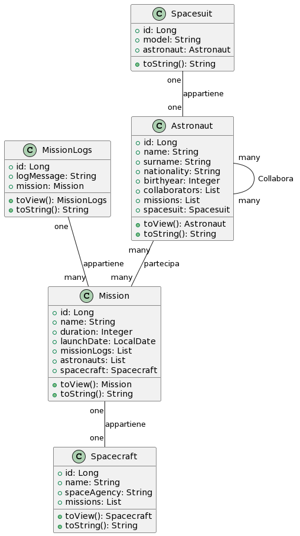
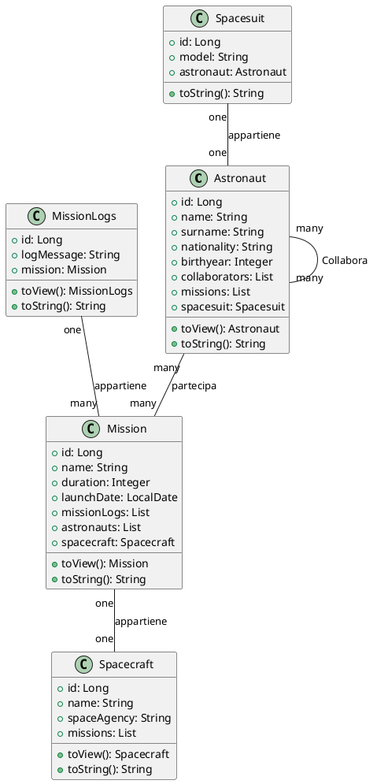
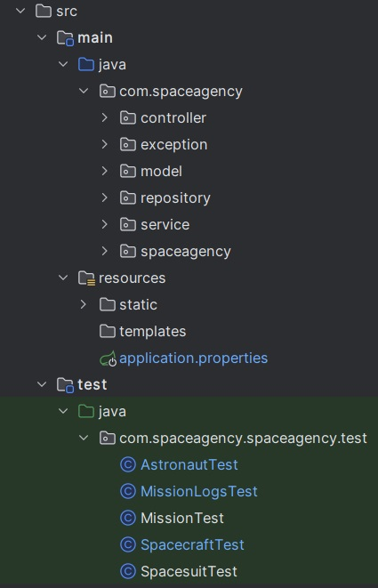
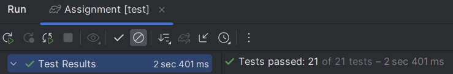

# 2023_assignment3_GruppoMTM

## Processo e sviluppo del software - Assignment 3

## Group Members

- Lorenzo Molinari
- Massimo Trippetta
- Lorenzo Megna

## Project Repository

- [Repository](https://gitlab.com/gruppomtm/2023_assignment3_gruppomtm)

## Panoramica

L'applicazione, sviluppata utilizzando tecnologie come:

- Spring
- JPA
- H2
- JUnit
- Lombok

Il progetto comprende le seguenti componenti:

- front-end
- back-end

Come database per la gestione del progetto abbiamo utilizzato H2, per avere la completa compatibilità con Spring e JPA

## Pattern di Design

1. **Pattern di Design del Controller:** Implementato utilizzando il pattern del Controller di Pagina. Ogni entità ha il
   suo controller dedicato responsabile dell'estrazione dei parametri, dell'utilizzo degli oggetti logici di business e
   della preparazione/chiamata della vista successiva.

2. **Pattern di Design del Template:** Utilizzato il pattern del Template View. La logica è separata dalla vista, e
   quest'ultima accede ai dati del modello attraverso marcatori nel codice HTML.

## Struttura del Progetto

Il progetto è organizzato in quattro pacchetti:

1. **Controller:** Riceve le chiamate, utilizza la logica implementata nel livello di servizio e fornisce una risposta.

2. **Service:** Implementa la logica di business.

3. **Model:** Definisce entità logiche, i loro attributi e metodi.

4. **Repository:** Si interfaccia con il database per persistere e recuperare gli oggetti.

5. **Test** Sono presenti tutti i test per i modelli creati ed i metodi implementati tramite i Controller

Per semplificare lo sviluppo e facilitare potenzialmente il riutilizzo del codice, è stata definita una classe astratta
di base per ciascun pacchetto. Questa classe viene successivamente estesa in base all'entità specifica da implementare.

## Diagramma delle Classi

## Descrizione

Il progetto Space Agency è un'applicazione completa sviluppata utilizzando le tecnologie Spring e JPA, focalizzata sulla
gestione delle informazioni legate agli astronauti, alle missioni spaziali e ai veicoli spaziali. L'obiettivo principale
è fornire un sistema robusto per poter monitorare e poter gestire le attività di una agenzia spaziale.

## Funzionalità Principali

### Astronauti

La gestione degli astronauti, gli astronauti possono essere aggiunti, visualizzati, modificati e rimossi dal sistema.
Ogni astronauta ha un nome, cognome e può essere associato a varie missioni spaziali.

### Missioni Spaziali

La gestione delle missioni spaziali, che sono registrate nel sistema, ciascuna con un nome univoco, una data di inizio e
una lista di astronauti coinvolti.

### Veicoli Spaziali

I veicoli spaziali, come sonde o navette, possono essere gestiti nel sistema. Ogni veicolo spaziale ha un nome univoco e
può essere associato a missioni spaziali specifiche.

### Logs delle Missioni

Ad ogni missione, astronauta e veicolo spaziale è assegnata un'entità log attraverso la quale è possibile recuperare i
diversi logs di un astronauta e/o di una navicella e/o di una missione.

### Tute spaziali

Le tute spaziali, sono gestite come modelli e sono in associazione univoca con ogni Astronauta, in fatti ogni astronauta
registrata può avere zero o una tute spaziali associate

## Struttura dei pacchetti java

Il progetto è organizzato in diversi package:

- **com.spaceagency.controller:** Contiene i controller che gestiscono le richieste HTTP e le interazioni con il
  frontend.

- **com.spaceagency.service:** Implementa la logica di business per le operazioni CRUD e le query personalizzate.

- **com.spaceagency.model:** Definisce le entità del dominio, come Astronaut, Mission, Spacecraft e MissionLogs.

- **com.spaceagency.repository:** Si interfaccia con il database H2 utilizzando Spring Data JPA per persistere e
  recuperare gli oggetti.

- **come.spaceagency.spaceagency.test:** Dove sono presenti i test per tutti le classi controller che possono essere
  verificati tramite JUnit

## Utilizzo del Database

Il sistema utilizza un database H2 per la persistenza dei dati, ed è possibili inizializzarlo e popolarlo con il metodo
dbl.run() della classe Database Loader. Grazie a questo comando è possibili popolare il database con delle entità di
prova in modo da poterlo utilizzare sia front-end da browser sia tramite linea di comando con il runmenu().

## API

### Astronaut

- `GET /astronauts`: Recupera la lista di tutti gli astronauti nel sistema.
- `GET /astronauts/{id}`: Recupera un astronauta specifico in base all'ID.
- `POST /astronauts`: Aggiunge un nuovo astronauta al sistema.
    - Parametri del corpo della richiesta:
        - `name` (String): Nome dell'astronauta.
        - `surname` (String): Cognome dell'astronauta.
        - `nationality` (String): Nazionalità dell'astronauta.
        - `birthyear` (Integer): Anno di nascita dell'astronauta.
- `GET /astronauts/collaborators/{id}` Recupera i collaboratori associati all'astronauta con uno specifico ID.
- `PUT /astronauts/{id}`: Aggiorna le informazioni di un astronauta esistente.
    - Parametri del corpo della richiesta:
        - `name` (String): Nome aggiornato dell'astronauta.
        - `surname` (String): Cognome aggiornato dell'astronauta.
        - `nationality` (String): Nazionalità aggiornata dell'astronauta.
        - `birthyear` (Integer): Anno di nascita aggiornato dell'astronauta.
- `DELETE /astronauts/{id}`: Rimuove un astronauta dal sistema.
- `GET /astronauts/search/name/{name}`: Recupera la lista di astronauti che corrispondono al nome specificato.
- `GET /astronauts/search/country/{nationality}`: Recupera la lista di astronauti che appartengono alla nazionalità
  specificata.
- `GET /astronauts/search/year/{year}`: Recupera la lista di astronauti che sono nati nell'anno specificato.
- `GET /astronauts/search/mission/{missionId}`: Recupera la lista di astronauti associati a una missione specifica.

### Spacecraft

- `GET /spacecrafts`: Recupera la lista di tutti i veicoli spaziali nel sistema.
- `GET /spacecrafts/{id}`: Recupera un veicolo spaziale specifico in base all'ID.
- `POST /spacecrafts`: Aggiunge un nuovo veicolo spaziale al sistema.
    - Parametri del corpo della richiesta:
        - `name` (String): Nome del veicolo spaziale.
        - `agency` (String): Agenzia spaziale responsabile del veicolo.
- `GET /spacecrafts/search/name/{name}`: Recupera la lista di veicoli spaziali che corrispondono al nome specificato.
- `GET /spacecrafts/search/spaceAgency/{spaceAgency}`: Recupera la lista di veicoli spaziali appartenenti alla specifica
  agenzia spaziale.
- `GET /spacecrafts/search/mission/{missionId}`: Recupera la lista di veicoli spaziali associati a una missione
  specifica.
- `PUT /spacecrafts/{id}`: Aggiorna le informazioni di un veicolo spaziale esistente.
    - Parametri del corpo della richiesta:
        - `name` (String): Nome aggiornato del veicolo spaziale.
        - `agency` (String): Agenzia aggiornata del veicolo spaziale.
- `DELETE /spacecrafts/{id}`: Rimuove un veicolo spaziale dal sistema.

### Mission

- `GET /missions`: Recupera la lista di tutte le missioni nel sistema.
- `GET /missions/{id}`: Recupera una missione specifica in base all'ID.
- `POST /missions`: Aggiunge una nuova missione al sistema.
    - Parametri del corpo della richiesta:
        - `name` (String): Nome della missione.
        - `duration` (Integer): Durata della missione in giorni.
        - `launchDate` (LocalDate): Data di lancio della missione.
- `GET /missions/search/name/{name}`: Recupera la lista di missioni che corrispondono al nome specificato.
- `GET /missions/search/launch-date/{launchDate}`: Recupera la lista di missioni con la data di lancio specificata.
- `GET /missions/search/spacecraft/{spacecraftId}`: Recupera la lista di missioni associate a un veicolo spaziale
  specifico.
- `GET /missions/search/astronaut/{astronautId}`: Recupera la lista di missioni associate a un astronauta specifico.
- `PUT /missions/{id}`: Aggiorna le informazioni di una missione esistente.
    - Parametri del corpo della richiesta:
        - `name` (String): Nome aggiornato della missione.
        - `duration` (Integer): Durata aggiornata della missione in giorni.
        - `launchDate` (String): Data di lancio aggiornata della missione.
- `DELETE /missions/{id}`: Rimuove una missione dal sistema.

## MissionLogsController

- `GET /missionlogs`: Recupera la lista di tutti i registri di missione nel sistema.
- `GET /missionlogs/mission/{missionId}`: Recupera i registri di missione associati a una specifica missione tramite
  l'ID della missione.
- `POST /missionlogs`: Aggiunge un nuovo registro di missione al sistema.
    - Parametri del corpo della richiesta:
        - `logMessage` (String): Messaggio di registro della missione.
        - `missionId` (Long): ID della missione a cui è associato il registro.
- `GET /missionlogs/{id}`: Recupera un registro di missione specifico in base all'ID.
- `GET /missionlogs/missionByLogId/{missionLogId}`: Recupera la missione associata a un registro di missione specifico
  tramite l'ID del registro.
- `POST /missionlogs/save`: Aggiunge un nuovo registro di missione al sistema utilizzando una richiesta JSON.
- `DELETE /missionlogs/{id}`: Rimuove un registro di missione dal sistema.
- `PUT /missionlogs/{id}`: Aggiorna le informazioni di un registro di missione esistente.
    - Parametri del corpo della richiesta:
        - `logMessage` (String): Messaggio di registro aggiornato della missione.

### Spacesuit

- `GET /spacesuits`: Recupera la lista di tutte le tute spaziali nel sistema.
- `GET /spacesuits/{id}`: Recupera una tuta spaziale specifica in base all'ID.
- `GET /spacesuits/search/name/{name}`: Recupera la lista di tute spaziali che corrispondono al nome specificato.
- `POST /spacesuits`: Aggiunge una nuova tuta spaziale al sistema.
    - Parametri del corpo della richiesta:
        - `model` (String): Modello della tuta spaziale.
- `POST /spacesuits/save`: Aggiunge una nuova tuta spaziale al sistema utilizzando una richiesta JSON.
- `GET /spacesuits/search/spacesuit/{astronautId}`: Recupera la tuta spaziale associata a un astronauta specifico
  tramite l'ID dell'astronauta.
- `DELETE /spacesuits/{id}`: Rimuove una tuta spaziale dal sistema.
- `PUT /spacesuits/{id}`: Aggiorna le informazioni di una tuta spaziale esistente.
    - Parametri del corpo della richiesta:
        - `model` (String): Modello aggiornato della tuta spaziale.

## Test

Per testare il programma, abbiamo utilizzato le seguenti classi:

- `AstronautTest`: testa il Controller, Service e Repository degli astronauti.
- `MissionTest`: testa il Controller, Service e Repository delle missioni.
- `SpacecraftTest`: testa il Controller, Service e Repository dei veicoli spaziali.
- `MissionLogsTest`: testa il Controller, Service e Repository dei Log delle varie missioni.
- `SpacesuitTest`: testa il Controller, Service e Repository delle tute spaziali.

I test sono stati eseguiti utilizzando JUnit sui vari metodi da verificare.

## Come Eseguire

Per eseguire il progetto, avviare il servizio utilizzando il file `SpaceAgencyApplication.java`. Dopo l'avvio, sarà possibile effettuare chiamate dirette tramite browser, ad esempio, `localhost:8080/astronauts` per ottenere il JSON corrispondente con tutti gli astronauti presenti nel database e i relativi attributi. Inoltre, è possibile abilitare un menu a linea di comando (eliminando i commenti dai comandi `dbL.run()` e `runMenu()` nel file `SpaceAgencyApplication.java`) per testare i vari metodi implementati dai Controller e interagire con le entità del Database.

Il vero utilizzo di questo programma avviene tramite interfaccia web-based raggiungibile dopo aver avviato l'applicazione all'URL: `localhost:8080`, consentendo l'interazione con il database e i controller tramite un'interfaccia utente user-friendly.

## Altre informazioni

- Abbiamo lavorato costantemente in gruppo (videochiamata e università) per il progetto. Tuttavia, abbiamo deciso di effettuare i commit principalmente da un unico account/computer, lavorando su un singolo PC per semplificare la scrittura del codice e garantire maggiore flessibilità possibile.
- Abbiamo mantenuto i file Gradle in GitLab, in quanto abbiamo riscontrato più volte la necessità di ricreare il programma da zero a causa di un commit che ha cancellato le varie impostazioni Gradle.
